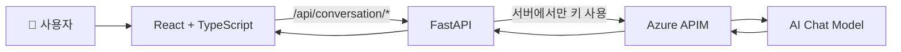

<div align="center">

# 🐰 눈치코치

### 말하는 방법을 배우고 실제처럼 연습하는 AI 역할극 코치

부모님·선생님·친구와의 고민을 이야기하면<br />
방법과 추천 문장을 알려 주고, 상대 역할을 맡아 실제 대화를 연습합니다.


</div>

---

## ✨ 어떤 서비스인가요?

**눈치코치**는 초등학교 3~6학년 어린이가 일상 속 관계 고민을 안전하게 이야기하고, 상대와 나를 함께 존중하는 말을 역할극으로 익히도록 만든 AI 대화 연습 서비스입니다.

AI는 코치 **눈치코치**로서 아이의 상황과 감정을 먼저 파악하고 구체적인 방법을 권합니다. 이어서 부모님이나 선생님, 친구 역할을 맡아 실제처럼 반응하고, 필요하면 짧게 코칭해 아이가 더 나은 방향으로 다시 말해보게 합니다.

> 예절은 무조건 참고 양보하는 것이 아니라, 나와 상대를 함께 존중하는 방법입니다.

## 🚀 개발된 기능

| 기능 | 설명 |
| --- | --- |
| 👥 상담 상대 선택 | 부모님, 선생님, 친한 친구, 새 친구, 형제자매 중 고민과 관련된 사람을 선택합니다. |
| 🎭 상대 반응 선택 | 다정한, 차분한, 활발한, 솔직한 방식 중 원하는 역할극 반응을 선택합니다. |
| ✨ AI 상황 생성 | 선택한 관계와 상담 방식에 맞는 예절 상담 주제 5개를 APIM의 AI가 생성합니다. |
| 💬 코칭과 역할극 | 상황에 맞는 방법과 추천 문장을 먼저 제안하고 선택한 상대를 연기합니다. |
| 🙇 관계별 예절 안내 | 존댓말, 차례 지키기, 허락 구하기, 사과하기, 경계 존중하기 등을 상황에 맞게 안내합니다. |
| 🧭 안전한 상담 | 위험·학대·자해와 관련된 내용은 믿을 수 있는 보호자나 선생님에게 알리도록 안내합니다. |
| 📊 대화 피드백 | 대화를 바탕으로 점수, 잘한 점, 다음에 실천할 행동을 AI가 평가합니다. |
| 🐇 반응형 토끼 UI | 귀여운 토끼 코치 테마로 PC와 모바일 화면을 모두 지원합니다. |

## 🧠 AI 상담 원칙

- 아이가 말한 내용을 구체적으로 인정하고 감정에 공감합니다.
- 맥락이 부족하면 훈계하거나 단정하지 않고 질문합니다.
- 상황에 필요한 예절 한 가지와 지금 할 수 있는 행동을 안내합니다.
- 아이에게 무조건 참거나 양보하라고 하지 않습니다.
- 아이가 바로 연습할 수 있는 짧은 추천 문장을 먼저 제시합니다.
- 선택한 상담 대상의 역할을 맡아 자연스럽게 반응하고, 필요한 순간에는 코치로 개입합니다.

## 🛠 기술 스택

### Frontend

| 기술 | 사용 목적 |
| --- | --- |
| **React 19** | 화면과 상담 상태 구성 |
| **TypeScript** | 타입 안전한 컴포넌트·API 데이터 관리 |
| **Vite** | 빠른 개발 서버와 프로덕션 빌드 |
| **CSS** | 별도 UI 라이브러리 없는 반응형 토끼 테마 |
| **Oxlint** | 프론트엔드 코드 정적 검사 |

### Backend & AI

| 기술 | 사용 목적 |
| --- | --- |
| **Python** | 백엔드 애플리케이션 개발 |
| **FastAPI** | 상담 API와 빌드된 프론트엔드 통합 제공 |
| **Uvicorn** | ASGI 애플리케이션 실행 |
| **Pydantic** | 요청·응답 데이터 검증 |
| **pydantic-settings** | `.env` 기반 APIM 설정 관리 |
| **HTTPX** | Azure APIM Chat Completions 비동기 호출 |
| **Pytest** | API와 APIM 서비스 로직 테스트 |

## 🏗 서비스 구조



프론트엔드는 APIM 주소나 키를 직접 알지 못합니다. 모든 AI 요청은 FastAPI를 거치며, 민감한 설정은 백엔드의 `.env`에만 저장됩니다.

## 🔄 상담 흐름

```text
상담 상대 선택 → 상담 방식 선택 → AI 상담 주제 생성
        → 공감 중심 대화 → 관계별 예절 안내 → AI 피드백
```

백엔드에서 제공하는 API는 다음과 같습니다.

| API | 역할 |
| --- | --- |
| `POST /api/conversation/suggest-scenarios` | 관계와 상담 방식에 맞는 주제 5개 생성 |
| `POST /api/conversation/reply` | 대화 기록과 현재 발화를 바탕으로 상담 답변 생성 |
| `POST /api/conversation/evaluate` | 전체 대화를 분석해 점수와 피드백 생성 |
| `GET /health` | 서버 상태 확인 |

## ⚙️ 실행 방법

### 1. 프로젝트 준비

```bash
npm install
python -m pip install -r backend/requirements.txt
```

### 2. APIM 환경 변수 설정

`backend/.env.example`을 복사해 `backend/.env`를 만들고 실제 값을 입력합니다.

```env
APIM_BASE_URL=https://your-apim.example.com
# 전체 Chat Completions URL을 사용할 경우 APIM_BASE_URL과 APIM_CHAT_PATH보다 우선합니다.
# APIM_CHAT_URL=https://your-apim.example.com/v1/chat/completions
APIM_CHAT_PATH=/v1/chat/completions
APIM_KEY=your-apim-key
APIM_KEY_HEADER=api-key
APIM_TIMEOUT_SECONDS=30
CHAT_MODEL=gpt-5.4
EMBEDDING_MODEL=text-embedding-3-small
VISION_MODEL=gpt-5.4
HISTORY_TURNS=5
CORS_ORIGINS=http://localhost:5173,http://127.0.0.1:5173
```

`backend/.env`에는 실제 키가 들어가므로 Git에 커밋하지 마세요.

### 3. 통합 서버 실행

Windows와 Linux 모두 프로젝트 루트에서 실행할 수 있습니다.

```bash
npm start
```

실행 후 브라우저에서 **http://localhost:8001**로 접속합니다.

### 개발 모드

두 개의 터미널에서 각각 실행합니다.

```bash
npm run backend
```

```bash
npm run dev
```

## ✅ 검증

```bash
# 프론트엔드 검사 및 빌드
npm run lint
npm run build

# 백엔드 테스트
cd backend
python -m pytest -q -p no:cacheprovider tests
```

## 📁 주요 폴더

```text
PrettyHojung/
├─ src/                    # React 프론트엔드
│  ├─ components/         # 설정·채팅·피드백 화면
│  ├─ services/           # FastAPI 호출 모듈
│  └─ assets/             # 토끼 마스코트와 이미지
├─ backend/
│  ├─ app/                # FastAPI, APIM 서비스, 시스템 프롬프트
│  └─ tests/              # 백엔드 테스트
├─ public/                # 파비콘과 공개 에셋
└─ README.md
```

---

<div align="center">

### 🐰 천천히 말해도 괜찮아요. 눈치코치가 먼저 들어 줄게요.

</div>
